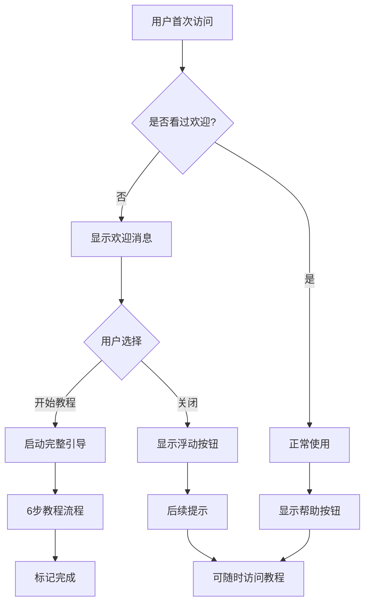

# 🎯 用户引导功能说明

## 📖 功能概述

CTF智能分析平台现已集成了完整的用户引导系统，旨在帮助新用户快速上手平台的所有功能。该系统包含多层级的引导体验，从简单的欢迎提示到详细的分步教程。

## ✨ 主要特性

### 🎉 智能欢迎系统
- **首次访问检测**：自动识别新用户并显示欢迎消息
- **分层引导**：提供轻量级提示和完整教程两种选择
- **用户偏好记忆**：记住用户的选择，避免重复打扰

### 📚 详细分步教程
- **6步完整指南**：从配置到使用的全流程引导
- **交互式步骤**：每步都可以点击跳转到对应功能
- **进度可视化**：清晰的进度条和步骤指示器
- **随时可访问**：可以随时重新查看教程

### 🎨 优雅的用户体验
- **响应式设计**：支持桌面和移动端
- **动画效果**：流畅的过渡动画和视觉反馈
- **可定制性**：支持跳过、暂停和重启教程

## 🚀 使用方式

### 首次访问
1. **自动欢迎**：新用户会在2秒后看到欢迎提示
2. **选择体验**：可以选择"开始教程"或直接关闭
3. **引导启动**：选择开始教程会打开完整的6步指南

### 手动访问
- **顶部按钮**：点击右上角的 🔧 帮助图标
- **浮动按钮**：点击右下角的浮动帮助按钮
- **任何时候**：用户可以随时重新查看教程

## 📋 教程内容

### 第1步：欢迎使用 🎉
- 平台介绍和核心特性
- 支持的CTF题型和AI服务
- 主要功能亮点展示

### 第2步：配置AI服务 ⚙️
- AI服务提供者介绍
- 配置步骤和最佳实践
- 快速配置建议

### 第3步：分析题目 🎯
- 题目提交方式
- 文本输入和文件上传
- 智能识别机制说明

### 第4步：查看结果 💡
- 分析结果解读
- 工具推荐使用
- 学习资源获取

### 第5步：管理记录 📊
- 功能导航介绍
- 历史记录管理
- 统计信息查看

### 第6步：完成 🏆
- 使用小贴士
- 最佳实践建议
- 后续学习指引

## 🛠️ 技术实现

### 组件架构
```
UserGuide.tsx        # 主引导组件
├── 分步教程逻辑
├── 进度管理
└── 动画效果

WelcomeTour.tsx      # 欢迎引导组件
├── 首次访问检测
├── 欢迎消息
├── 浮动帮助按钮
└── 提示管理

UserGuide.css       # 样式文件
├── 响应式设计
├── 动画效果
├── 主题适配
└── 移动端优化
```

### 状态管理
- **localStorage**：持久化用户偏好和进度
- **React State**：管理当前显示状态
- **条件渲染**：智能决定显示内容

### 数据持久化
```javascript
// 存储的用户状态
ctf_guide_completed      // 已完成教程
ctf_guide_skipped        // 已跳过教程
ctf_welcome_seen         // 已看过欢迎消息
ctf_guide_completed_time // 完成时间
ctf_auto_start_guide     // 自动启动标志
```

## 🎨 设计原则

### 1. 渐进式引导
- 从简单提示开始
- 提供详细教程选项
- 用户可以随时选择深入了解

### 2. 非侵入性
- 不强制用户观看教程
- 提供明确的跳过选项
- 记住用户的选择

### 3. 上下文相关
- 在合适的时机显示提示
- 提供与当前功能相关的指导
- 避免信息过载

### 4. 视觉友好
- 使用Material-UI组件
- 一致的设计语言
- 清晰的视觉层次

## 📊 用户体验流程



## 🔧 配置选项

### 环境变量
目前无需额外环境变量，所有配置通过localStorage管理。

### 自定义选项
可以通过修改组件代码来调整：
- 欢迎消息显示时间
- 教程步骤内容
- 动画效果和样式
- 本地存储键名

## 📈 效果评估

### 成功指标
- **教程完成率**：用户完成完整教程的比例
- **功能使用率**：引导后各功能的使用情况
- **用户留存**：新用户的平台使用时长
- **反馈质量**：用户对引导体验的评价

### 数据收集
当前版本通过localStorage记录基本状态，可以扩展为：
- 服务端统计分析
- 用户行为追踪
- A/B测试支持

## 🚀 未来改进

### 短期优化
1. **个性化内容**：根据用户背景调整教程内容
2. **多语言支持**：提供国际化版本
3. **交互增强**：添加更多互动元素
4. **性能优化**：减少组件加载时间

### 长期规划
1. **智能推荐**：基于用户行为推荐相关功能
2. **社区集成**：连接用户社区和帮助文档
3. **AI辅助**：使用AI生成个性化教程内容
4. **数据驱动**：基于用户数据优化引导流程

## 📞 反馈和支持

如果您在使用引导功能时遇到问题或有改进建议，请通过以下方式联系我们：

- 📧 **邮件**：feedback@ctf-platform.com
- 🐛 **Bug报告**：[GitHub Issues](https://github.com/your-repo/issues)
- 💡 **功能建议**：[GitHub Discussions](https://github.com/your-repo/discussions)

---

*此功能旨在提供更好的新用户体验，帮助用户快速掌握平台的强大功能。我们会持续优化和改进，为CTF学习者提供更好的服务。* 